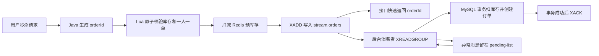

# 点评系统 Redis 后端

一个本地生活点评系统，包含商铺浏览、探店笔记、用户登录、优惠券秒杀和异步下单链路。项目由 Spring Boot 后端、MySQL 数据库、Redis 缓存/MQ 能力和一套本地静态前端页面组成。

## 页面展示

| 首页信息流 | 商铺详情与优惠券 |
| --- | --- |
|  |  |

## 功能概览

- 用户登录：验证码登录、Redis Hash 存储 token、登录态 TTL 自动刷新。
- 商铺服务：商铺列表、商铺详情、分类缓存、商铺更新后的缓存删除。
- 探店内容：笔记发布、点赞、详情查看、滚动分页信息流。
- 优惠券服务：普通券、秒杀券、库存初始化、秒杀下单。
- 高并发下单：Lua 原子校验、Redis Stream 异步订单队列、pending-list 补偿。

## 技术栈

| 层级 | 技术 |
| --- | --- |
| 后端 | Java 17、Spring Boot 2.7.3、Spring MVC |
| 数据访问 | MyBatis-Plus、MySQL 8 |
| Redis 能力 | Redis Hash、String、Set、Lua、Stream、Redisson |
| 前端展示 | Vue 2、Element UI、Nginx 静态资源与 API 代理 |
| 构建测试 | Maven、JUnit 5、Mockito |

## 核心链路



这条链路把高并发入口和数据库写入解耦：Redis 负责入口校验、预扣库存和消息排队，MySQL 负责最终落库并用 `stock > 0` 条件更新做兜底。

## 项目结构

```text
.
├── review-backend/
│   ├── pom.xml
│   └── src/main/java/com/aschen/redis
│       ├── config
│       ├── controller
│       ├── dto
│       ├── entity
│       ├── interceptor
│       ├── mapper
│       ├── service
│       └── utils
├── nginx-1.18.0/
│   ├── conf/nginx.conf
│   └── html/review
└── docs/screenshots
```

## 本地运行

准备环境：

- JDK 17
- Maven 3.8+
- MySQL 8
- Redis 6+
- Nginx

初始化数据库：

```sql
CREATE DATABASE IF NOT EXISTS review_platform DEFAULT CHARACTER SET utf8mb4;
```

```powershell
mysql -u root -p review_platform < review-backend/src/main/resources/db/review_platform.sql
```

配置环境变量：

```powershell
$env:MYSQL_PASSWORD='your_mysql_password'
$env:REDIS_HOST='127.0.0.1'
$env:REDIS_PORT='6380'
```

启动后端：

```powershell
Set-Location review-backend
mvn spring-boot:run
```

启动前端代理后访问：

```text
http://localhost:8080
```

`nginx-1.18.0/conf/nginx.conf` 会将前端 `/api` 请求转发到 `http://127.0.0.1:8081`。

## 验证

```powershell
Set-Location review-backend
mvn -DskipTests compile
mvn "-Dtest=com.aschen.redis.service.impl.VoucherOrderServiceImplTest" "-DforkCount=0" test
```
