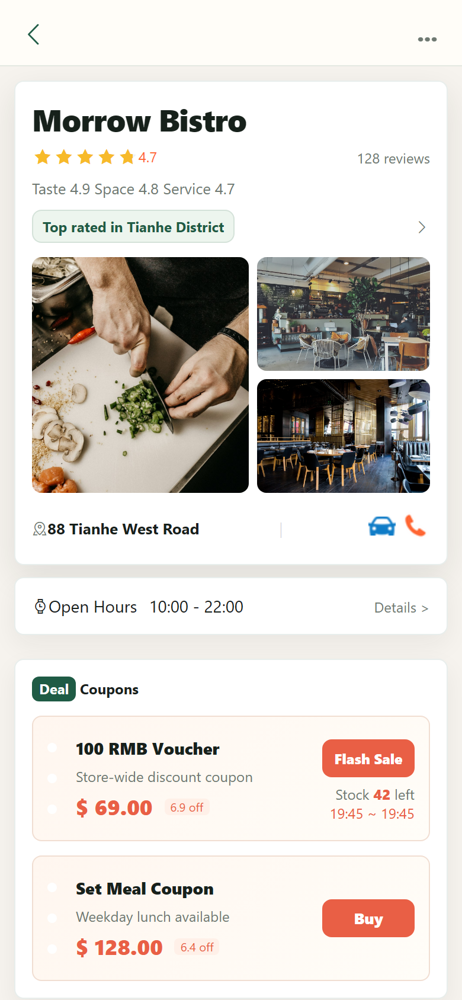
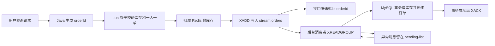

# Urban-Pulse

基于 Spring Boot、MySQL 与 Redis 的本地生活点评后端，围绕登录态、商铺缓存、内容信息流以及优惠券秒杀订单链路展开。项目重点是可解释的 Java 后端实现：Cache Aside、Lua 原子校验、Redis Stream 异步下单和事务落库；仓库内的 Vue 2 / Nginx 页面仅作为本地演示客户端。

## 项目定位

- **缓存治理**：Redis 登录态、商铺缓存、空值缓存与数据库更新后的缓存删除。
- **交易链路**：Lua 在 Redis 内完成库存与一人一单校验，Stream 解耦请求入口和 MySQL 写入。
- **可靠消费**：数据库事务成功后 ACK；主消费发生异常时进入 pending-list 补偿。
- **学习与复盘**：`docs/Urban-Pulse项目拆解/` 按源码记录架构、边界、缺陷与推荐改进。

## 页面展示

| 首页信息流 | 商铺详情与优惠券 |
| --- | --- |
|  |  |

## 功能概览

- 用户登录：验证码登录、Redis Hash 存储 token、登录态 TTL 自动刷新。
- 商铺服务：商铺列表、商铺详情、分类缓存、商铺更新后的缓存删除。
- 探店内容：笔记发布、点赞、详情查看、滚动分页信息流。
- 优惠券服务：普通券、秒杀券、库存初始化、秒杀下单。
- 高并发下单：Lua 原子校验、Redis Stream 异步订单队列、消费异常后的 pending-list 补偿。

## 技术栈

| 层级 | 技术 |
| --- | --- |
| 后端 | Java 21、Spring Boot 2.7.3、Spring MVC |
| 数据访问 | MyBatis-Plus、MySQL 8 |
| Redis 能力 | Redis Hash、String、Set、Lua、Stream、Redisson |
| 前端展示 | Vue 2、Element UI、Nginx 静态资源与 API 代理 |
| 构建测试 | Maven、JUnit 5、Mockito |

## 核心链路



这条链路把高并发入口和数据库写入解耦：Redis 负责入口校验、预扣库存和消息排队，MySQL 负责最终落库并用 `stock > 0` 条件更新做兜底。

## 实现边界

- Vue 2 / Nginx 静态页面用于演示接口联调，不作为本项目的主要原创实现范围。
- pending-list 补偿目前在主消费异常后触发；应用启动时不会主动扫描旧 pending 消息。
- 仓库保留互斥锁与逻辑过期等缓存练习代码，但当前商铺查询主链路使用 Cache Aside 与空值缓存，不把练习实现描述为已上线能力。
- 当前消费者名固定，订单表也需要补充业务唯一约束后才能把链路描述为生产级幂等方案。

## 项目结构

```text
.
├── review-backend/
│   ├── pom.xml
│   └── src/main/java/com/aschen/redis
│       ├── config
│       ├── controller
│       ├── dto
│       ├── entity
│       ├── interceptor
│       ├── mapper
│       ├── service
│       └── utils
├── nginx-1.18.0/
│   ├── conf/nginx.conf
│   └── html/review
└── docs/screenshots
```

## 本地运行

准备环境：

- JDK 21
- Maven 3.8+
- MySQL 8
- Redis 6+
- Nginx

初始化数据库：

```sql
CREATE DATABASE IF NOT EXISTS review_platform DEFAULT CHARACTER SET utf8mb4;
```

```powershell
mysql -u root -p review_platform < review-backend/src/main/resources/db/review_platform.sql
```

配置环境变量：

```powershell
$env:MYSQL_PASSWORD='your_mysql_password'
$env:REDIS_HOST='127.0.0.1'
$env:REDIS_PORT='6380'
```

启动后端：

```powershell
Set-Location review-backend
mvn spring-boot:run
```

启动前端代理后访问：

```text
http://localhost:8080
```

`nginx-1.18.0/conf/nginx.conf` 会将前端 `/api` 请求转发到 `http://127.0.0.1:8081`。

## 验证

```powershell
Set-Location review-backend
mvn clean test
```

只验证秒杀订单服务时可运行：

```powershell
mvn "-Dtest=com.aschen.redis.service.impl.VoucherOrderServiceImplTest" "-DforkCount=0" test
```
