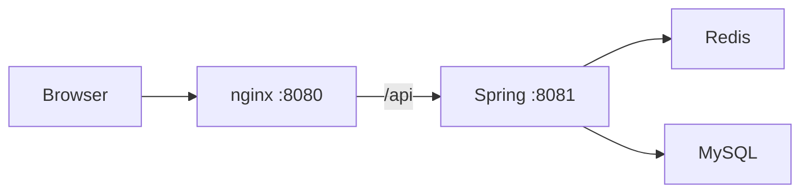

# 01. 项目全貌与技术栈

## 项目解决什么问题

Urban-Pulse 模拟本地生活点评场景，仓库当前包含：

- 手机验证码登录和用户信息查询。
- 店铺、店铺类型的查询与更新。
- 探店笔记发布、热门列表和简单点赞计数。
- 普通优惠券、秒杀券和异步订单创建。
- 图片上传。
- 评论、关注等数据模型和基础空壳，但业务接口尚未完成。

## 运行架构



### 请求怎么流动

1. 浏览器访问 `http://localhost:8080`。
2. nginx 从 `html/review` 返回静态页面。
3. 前端 Axios 的 `baseURL` 是 `/api`。
4. nginx 把 `/api/user/me` 改写成 `/user/me` 并代理到 `127.0.0.1:8081`。
5. Spring MVC 匹配 Controller。
6. Service 调用 Redis 或 MyBatis-Plus。
7. 后端统一返回 `Result` JSON。

对应文件：

- `nginx-1.18.0/conf/nginx.conf`
- `nginx-1.18.0/html/review/js/common.js`
- `review-backend/src/main/resources/application.yaml`

## 技术栈逐项解释

| 技术 | 项目中的真实用途 |
| --- | --- |
| Java 21 | `pom.xml` 的编译 release；README 中的 JDK 17 说明已过期 |
| Spring Boot 2.7.3 | 自动配置、依赖注入、应用启动 |
| Spring MVC | Controller、参数绑定、拦截器、异常处理 |
| Spring Data Redis | `StringRedisTemplate`、Lua、Stream、Hash、String、Set、ZSet |
| MyBatis-Plus 3.4.3 | `BaseMapper`、`ServiceImpl`、链式查询和更新、分页 |
| MySQL 8 | 用户、店铺、笔记、优惠券和订单最终持久化 |
| Redisson 3.13.6 | 创建了 `RedissonClient` Bean；当前核心秒杀链路没有实际使用它加锁 |
| Hutool 5.7.17 | UUID、随机验证码、Bean/Map 转换、JSON、字符串和文件工具 |
| Jackson | Spring JSON 序列化，配置忽略 null 字段 |
| Lombok | `@Data`、构造器、日志对象 |
| JUnit 5 | 测试框架 |
| Mockito | 秒杀入口的隔离单元测试 |
| nginx | 静态文件服务和 `/api` 反向代理 |
| Vue 2 + Axios | 配套演示客户端与接口联调，不作为后端作者的前端成果 |

## Spring Boot 启动类

```java
@MapperScan("com.aschen.redis.mapper")
@SpringBootApplication
@EnableAspectJAutoProxy(exposeProxy = true)
public class ReviewRedisApplication {
    public static void main(String[] args) {
        SpringApplication.run(ReviewRedisApplication.class, args);
    }
}
```

- `@SpringBootApplication` 组合了配置、组件扫描和自动配置。
- `@MapperScan` 为 Mapper 接口生成代理对象，否则空接口无法直接注入。
- `exposeProxy = true` 允许通过 AOP 上下文拿代理对象。不过当前 Stream 代码改用 `TransactionTemplate`，已经不依赖消费线程中的 `AopContext.currentProxy()`。

## application.yaml

关键默认值：

```yaml
server.port: 8081
spring.datasource.url: jdbc:mysql://127.0.0.1:3306/review_platform
spring.redis.host: 127.0.0.1
spring.redis.port: 6380
```

配置采用 `${ENV:default}` 写法，因此密码等可以由环境变量注入。生产环境不应该把真实密码提交到仓库。

Redis Lettuce 池最大活动连接数为 10。它不代表系统只能处理 10 个请求，而是同时占用 Redis 连接的上限；连接会复用，阻塞 Stream 读取也会长期占用连接，需要在真实部署中结合并发量评估。

## nginx 代理为什么存在

前端页面运行在 8080，后端运行在 8081。如果浏览器直接请求 8081，会出现跨域问题。当前做法让浏览器始终访问同源的 8080，再由 nginx 在服务端转发：

```nginx
location /api {
    rewrite /api(/.*) $1 break;
    proxy_pass http://backend;
}
```

## 项目的核心和辅助部分

### 核心

- Redis 登录态和双拦截器。
- 店铺缓存策略。
- RedisIdWorker。
- Lua + Redis Stream 秒杀订单。

### 辅助

- 普通 CRUD 和分页。
- 图片上传。
- 前端展示页面。

### 尚未完成

- 真正的登出。
- 评论接口。
- 关注接口。
- Feed 流。
- ZSet 点赞用户列表和点赞取消。
- 签到、Geo 附近店铺等常量对应功能。

## 面试 30 秒讲法

> Urban-Pulse 是一个 Spring Boot 本地生活点评后端，MySQL 负责业务数据，Redis 负责登录态、店铺缓存和秒杀入口。项目最核心的是 Lua 与 Redis Stream 异步下单：请求线程完成原子资格校验并快速返回订单 ID，后台消费者再通过事务写 MySQL，成功后 ACK，失败进入 pending-list 补偿。

## 自测

1. 浏览器请求为什么先到 8080，而后端为什么是 8081？
2. `/api` 在 nginx 中被怎样改写？
3. MyBatis-Plus 的 Mapper 为什么可以是空接口？
4. Redisson 已经引入是否等于核心业务正在使用 Redisson 锁？
5. 当前哪些业务只是数据模型或常量，不能说成已完成？

