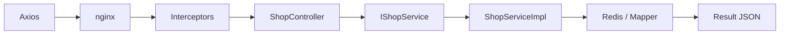

# 04. Spring Boot 分层与请求流程

## 一个请求经过什么

以 `GET /api/shop/1` 为例：



## Controller 层

```java
@RestController
@RequestMapping("/shop")
public class ShopController {
    @Resource
    public IShopService shopService;

    @GetMapping("/{id}")
    public Result queryShopById(@PathVariable("id") Long id) {
        return shopService.queryShopById(id);
    }
}
```

### 每段在做什么

- `@RestController`：方法返回值直接序列化为 JSON。
- `@RequestMapping("/shop")`：类级路径前缀。
- `@GetMapping("/{id}")`：把 GET `/shop/1` 匹配到方法。
- `@PathVariable`：从路径取出 `1` 并转换为 Long。
- Controller 不写缓存和 SQL，只转发给 Service。

## Service 接口层

```java
public interface IShopService extends IService<Shop> {
    Result queryShopById(Long id);
    Result updateShop(Shop shop);
}
```

`IService<Shop>` 来自 MyBatis-Plus，提供 `getById`、`save`、`updateById`、`query()` 等通用能力。自定义业务方法写在接口里，便于 Controller 依赖抽象。

小项目也可以直接注入实现类，但接口能让职责更清楚，也便于代理和测试替换。

## Service 实现层

```java
@Service
public class ShopServiceImpl
        extends ServiceImpl<ShopMapper, Shop>
        implements IShopService {
}
```

`ServiceImpl<ShopMapper, Shop>` 已经持有 `baseMapper`，所以实现类可以直接调用：

```java
getById(id);
save(shop);
updateById(shop);
query().eq("type_id", typeId).list();
```

## Mapper 层为什么是空接口

```java
public interface ShopMapper extends BaseMapper<Shop> {
}
```

运行时 MyBatis 根据 Mapper 接口生成代理对象，`BaseMapper` 已提供基础 SQL。启动类的 `@MapperScan` 负责扫描它们。

空接口不是“什么都没做”，而是复用了框架生成的 CRUD。

## 什么时候需要 XML

优惠券查询要把两张表组合起来，因此 `VoucherMapper` 自定义方法：

```java
List<Voucher> queryVoucherOfShop(@Param("shopId") Long shopId);
```

XML：

```sql
SELECT v.id, v.shop_id, v.title, v.pay_value,
       v.actual_value, v.type,
       sv.stock, sv.begin_time, sv.end_time
FROM tb_voucher v
LEFT JOIN tb_seckill_voucher sv ON v.id = sv.voucher_id
WHERE v.shop_id = #{shopId} AND v.status = 1
```

普通券没有秒杀表记录，使用 LEFT JOIN 仍能返回，只是 `stock/beginTime/endTime` 为 null。

## 统一 Result

```java
public class Result {
    private Boolean success;
    private String errorMsg;
    private Object data;
    private Long total;

    public static Result ok(Object data) {
        return new Result(true, null, data, null);
    }

    public static Result fail(String errorMsg) {
        return new Result(false, errorMsg, null, null);
    }
}
```

前端不需要猜每个接口的 JSON 格式，只判断 `success`。缺点是它没有泛型和明确错误码，生产项目通常会用 `Result<T>`、业务错误码和合适 HTTP 状态。

## 全局异常处理

```java
@RestControllerAdvice
public class WebExceptionAdvice {
    @ExceptionHandler(RuntimeException.class)
    public Result handleRuntimeException(RuntimeException e) {
        log.error(e.toString(), e);
        return Result.fail("服务器异常");
    }
}
```

业务方法抛 RuntimeException 时，Advice 记录完整异常，但只向客户端返回通用提示，避免泄露堆栈。

当前问题：响应可能仍是 HTTP 200，只是 `success=false`。更成熟的系统会区分参数错误、未登录、资源不存在和服务器错误。

## 分页插件

```java
@Bean
public MybatisPlusInterceptor mybatisPlusInterceptor() {
    MybatisPlusInterceptor interceptor = new MybatisPlusInterceptor();
    interceptor.addInnerInterceptor(new PaginationInnerInterceptor(DbType.MYSQL));
    return interceptor;
}
```

Controller 中：

```java
Page<Shop> page = shopService.query()
        .eq("type_id", typeId)
        .page(new Page<>(current, SystemConstants.DEFAULT_PAGE_SIZE));
```

分页插件把查询改写为 MySQL limit 语句。`current` 是页码，`DEFAULT_PAGE_SIZE` 当前为 5。

## 拦截器发生在 Controller 之前

`MvcConfig` 注册：

1. `RefreshTokenInterceptor`，order 0，对所有路径运行。
2. `loginInterceptor`，order 1，只拦截未排除的路径。

所以 Controller 调用 `UserHolder.getUser()` 前，用户已经由第一个拦截器恢复到 ThreadLocal。

具体细节见登录章节。

## @Transactional 在哪里生效

店铺更新：

```java
@Transactional(rollbackFor = Exception.class)
public Result updateShop(Shop shop) {
    updateById(shop);
    stringRedisTemplate.delete(CACHE_SHOP_KEY + shop.getId());
    return Result.ok();
}
```

`@Transactional` 通过 Spring AOP 代理生效。需要注意：Redis 删除不属于 MySQL 本地事务；MySQL 回滚不会自动恢复 Redis 操作。

Stream 消费线程使用 `TransactionTemplate`，因为内部线程直接调用本类方法容易绕过 Spring 代理。这个问题在秒杀章节详细讲。

## 依赖注入风格

仓库同时出现：

- `@Resource`
- `@Autowired`
- 构造器注入

更推荐构造器注入：依赖可设为 final、测试方便、类无法在缺少依赖时被构造。当前代码风格并不统一，面试可以说明会逐步统一，但不要说已经完成重构。

## 一次标准请求的完整复述

> 浏览器通过 nginx 的 `/api` 代理访问 Spring Boot。请求先经过 token 刷新和登录拦截器，DispatcherServlet 再根据注解匹配 Controller。Controller 只处理 HTTP 参数并调用 Service；Service 承载缓存、事务和业务规则，通过 MyBatis-Plus Mapper 访问 MySQL。最后用统一 Result 返回 JSON，RuntimeException 由全局 Advice 处理。

## 自测

1. `@RestController` 和普通 `@Controller` 有什么区别？
2. 空 Mapper 为什么能执行 SQL？
3. 自定义联表查询为什么写 XML？
4. `@Transactional` 为什么可能因自调用失效？
5. Redis 操作能否自动加入 MySQL 本地事务？
