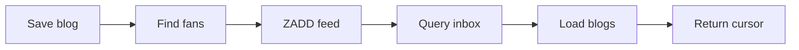

# 08. 关注关系与 Feed：当前现状和补全路径

## 先给结论

当前关注和 Feed 业务没有完成。

仓库只有：

- `tb_follow` 表。
- `Follow` Entity。
- 空的 Mapper、Service 接口/实现和 Controller。
- `FEED_KEY = "feed:"` 常量。
- 未被使用的 `ScrollResult`。

因此这章的价值是：看懂已有脚手架，并知道如果接着写，应如何形成完整链路。

## 当前数据模型

```java
@TableName("tb_follow")
public class Follow {
    @TableId(value = "id", type = IdType.AUTO)
    private Long id;
    private Long userId;
    private Long followUserId;
    private LocalDateTime createTime;
}
```

语义：`userId` 关注 `followUserId`。

SQL 当前只有主键，没有：

```sql
UNIQUE (user_id, follow_user_id)
```

因此数据库不会自动阻止重复关注。这是推荐增加的约束。

## 当前代码为什么不算实现

Controller：

```java
@RestController
@RequestMapping("/follow")
public class FollowController {
}
```

Service：

```java
@Service
public class FollowServiceImpl
        extends ServiceImpl<FollowMapper, Follow>
        implements IFollowService {
}
```

它们只让 Spring 能创建 Bean，且继承了通用 CRUD，但没有对外接口和关注业务规则。

## 如果继续实现关注，先写什么

以下均为**推荐补全路径**。

### 第一步：关注/取消关注接口

```text
PUT /follow/{followUserId}/{isFollow}
```

业务规则：

1. 从 UserHolder 取当前 userId。
2. `isFollow=true` 时插入关系。
3. `isFollow=false` 时按两个 userId 删除。
4. 依赖数据库唯一索引处理重复提交。

### 第二步：判断是否关注

```text
GET /follow/or/not/{followUserId}
```

查询条件：

```sql
WHERE user_id = currentUser
  AND follow_user_id = targetUser
```

### 第三步：共同关注

可以为每个用户维护 Redis Set：

```text
Key: follows:{userId}
Member: followUserId
```

两个用户的共同关注可以用 `SINTER`。但当前项目没有对应常量和同步逻辑，所以这只是设计建议。

## Feed 是什么

用户关注作者后，希望看到作者发布的新笔记。常见模型：

### 拉模式

用户打开 Feed 时查询所有关注作者的新内容。

优点：发布便宜。缺点：关注很多人时读取昂贵。

### 推模式

作者发布时，把笔记 ID 写入每个粉丝的收件箱。

优点：读取快。缺点：大 V 发布时写放大。

### 推拉结合

普通作者推送，大 V 内容读取时拉取。复杂但更适合大规模系统。

## 这个项目适合怎样补 Feed

教程型规模可以使用推模式。

### 发布笔记时

```text
保存 Blog
→ 查询作者所有粉丝
→ 对每个粉丝执行 ZADD
```

Redis 结构：

```text
Key:    feed:{fanUserId}
Member: blogId
Score:  publishTimestamp
```

项目已有 `FEED_KEY = "feed:"`，但没有任何 `opsForZSet()` Feed 写入代码。

## 为什么 Feed 用 ZSet

- member 保存笔记 ID。
- score 保存发布时间戳。
- 可以按 score 倒序取最新消息。
- 可以使用 score 游标实现滚动分页。

## 滚动分页为什么需要 offset

假设第一页按时间倒序读到：

```text
blog 10 score=1000
blog 9  score=999
blog 8  score=999
```

下一页若只传 `max=999`，可能再次读到 blog 9、8。需要同时传：

```text
minTime = 999
offset = 本页中 score=999 的元素数量
```

下一次在相同 score 上跳过这些元素。

这正是 `ScrollResult` 三个字段的用途，但当前代码没有实现对应查询。

## 推荐调用链



## 生产问题

即使补上基本 Feed，还要考虑：

- 大 V 数百万粉丝导致写放大。
- 删除笔记如何清理所有收件箱。
- 关注后是否补历史内容。
- 取消关注后旧消息是否保留。
- ZSet 长期增长如何裁剪。
- 推送一半失败如何补偿。

当前项目规模不需要全部实现，但面试时知道这些边界比假装“Feed 已完成”更可靠。

## 面试口径

> 当前仓库建立了关注表、Entity 和 Redis Feed 常量，但关注接口和 Feed 业务尚未完成。我能说明合理的补全路径：先完成带唯一约束的关注关系，再在发布笔记时查询粉丝，把 blogId 按时间戳写入粉丝的 ZSet 收件箱，读取时通过 max 和 offset 做滚动分页。不过这些属于后续设计，不是当前已实现成果。

## 自测

1. 当前 FollowServiceImpl 有哪些真实业务逻辑？
2. 关注表为什么需要组合唯一索引？
3. 推模式和拉模式各有什么代价？
4. Feed 为什么用 ZSet？
5. 同一时间戳有多条消息时为什么需要 offset？
6. `FEED_KEY` 存在是否能证明 Feed 已实现？

