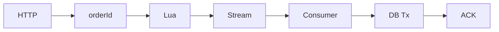

# 10. Redis Stream 秒杀下单

## 本章目标

这是 Urban-Pulse 最核心的技术链路。学完必须能回答：

- 为什么请求线程不直接写 MySQL。
- Lua 到底保证了什么，又没有保证什么。
- Redis Stream 为什么需要消费者组、ACK 和 pending-list。
- 为什么数据库还要再检查一人一单和 `stock > 0`。
- 消息重复、消费者宕机和数据库失败时会发生什么。

## 一句话架构

> Java 先生成 orderId，Lua 原子完成 Redis 库存判断、一人一单、预扣库存和 Stream 投递；HTTP 快速返回 orderId，后台消费者再在 MySQL 事务中扣库存并创建订单，事务提交后 ACK。

## 总调用链



展开：

```text
POST /voucher-order/seckill/{voucherId}
→ 从 UserHolder 获取 userId
→ RedisIdWorker 生成 orderId
→ 执行 seckill.lua
   → 检查 seckill:stock:{voucherId}
   → 检查 seckill:order:{voucherId} 是否已有 userId
   → Redis 库存 -1
   → Set 加入 userId
   → XADD stream.orders
→ 返回 orderId

后台线程：
XREADGROUP stream.orders
→ Map 转 VoucherOrder
→ TransactionTemplate
→ 检查 MySQL 重复订单
→ stock = stock - 1 WHERE stock > 0
→ INSERT tb_voucher_order
→ COMMIT
→ XACK
```

## 为什么先理解同步版本

最简单的同步下单会在 HTTP 线程中：

```text
查 MySQL 库存
→ 查用户是否下过单
→ 扣库存
→ 插订单
→ 返回
```

高并发时问题是：

- 所有请求直接占用数据库连接。
- 同一库存行竞争严重。
- “先查再改”存在竞态。
- 用户需要等待完整数据库事务。

异步方案把高并发入口放在 Redis，数据库按消费者速度平滑处理。这叫削峰，不是让数据库凭空变快。

## Controller 入口

```java
@RestController
@RequestMapping("/voucher-order")
public class VoucherOrderController {

    @Resource
    private IVoucherOrderService iVoucherOrderService;

    @PostMapping("/seckill/{id}")
    public Result seckillVoucher(@PathVariable("id") Long id) {
        return iVoucherOrderService.seckillVoucher(id);
    }
}
```

注释写“这里是用户 id”是错误的；这个 `id` 实际是 voucherId。userId 来自登录上下文。

完整路径：

```text
POST /voucher-order/seckill/{voucherId}
```

该路径没有被 `MvcConfig` 排除，所以正常情况下需要登录。

## Service 的固定配置

```java
private static final String STREAM_ORDERS_KEY = "stream.orders";
private static final String STREAM_ORDERS_GROUP = "g1";
private static final String STREAM_ORDERS_CONSUMER = "c1";
private static final Duration STREAM_BLOCK_TIMEOUT =
        Duration.ofSeconds(2);

private static final ExecutorService SECKILL_ORDER_EXECUTOR =
        Executors.newSingleThreadExecutor();
```

- Stream 名：`stream.orders`。
- 消费组：`g1`。
- 消费者：`c1`。
- 一次最多取一条，最多阻塞两秒。
- 一个 JVM 只启动一个消费线程。

单线程简化了并发落库，但吞吐上限也受单消费者限制。

固定消费者名在多实例中不合适。不同实例应使用唯一 consumer name，例如 `hostname-processId`。

## Lua 脚本加载

```java
private static final DefaultRedisScript<Long> SECKILL_SCRIPT;

static {
    SECKILL_SCRIPT = new DefaultRedisScript<>();
    SECKILL_SCRIPT.setLocation(
            new ClassPathResource("seckill.lua")
    );
    SECKILL_SCRIPT.setResultType(Long.class);
}
```

静态初始化只加载一次脚本资源和返回类型。Spring Data Redis 执行时会优先使用脚本 SHA，必要时发送脚本文本。

## 应用启动时初始化 Stream

```java
@PostConstruct
private void init() {
    initStreamConsumerGroup();
    SECKILL_ORDER_EXECUTOR.submit(new VoucherOrderHandler());
}
```

`@PostConstruct` 在依赖注入完成后运行：先创建消费者组，再启动后台线程。顺序不能反，否则消费者读取一个不存在的组会报错。

### XGROUP CREATE

```java
stringRedisTemplate.execute((RedisCallback<Object>) connection ->
        connection.execute(
                "XGROUP",
                "CREATE".getBytes(UTF_8),
                STREAM_ORDERS_KEY.getBytes(UTF_8),
                STREAM_ORDERS_GROUP.getBytes(UTF_8),
                "$".getBytes(UTF_8),
                "MKSTREAM".getBytes(UTF_8)
        )
);
```

对应 Redis 命令：

```redis
XGROUP CREATE stream.orders g1 $ MKSTREAM
```

- `MKSTREAM`：Stream 不存在时先创建。
- `$`：组从创建时的最新消息之后开始消费。
- 如果组已存在，Redis 返回 `BUSYGROUP`。

代码只忽略 `BUSYGROUP`：

```java
catch (Exception e) {
    String message = e.getMessage();
    if (message == null || !message.contains("BUSYGROUP")) {
        throw new IllegalStateException(..., e);
    }
}
```

### `$` 的风险

正常启动时先建组再开放接口，因此没有历史消息。但如果 Stream 已经有消息而消费者组丢失，使用 `$` 会跳过已有消息。更稳妥的恢复策略应根据业务决定从 `0` 还是 `$` 建组。

## 请求线程：只生成一次 orderId

```java
Long userId = UserHolder.getUser().getId();
long orderId = redisIdWorker.nextId("order");
```

为什么在 Lua 前生成：

- orderId 要写入 Stream。
- HTTP 成功时要立即返回同一个 ID。
- 消费线程最终用它作为数据库订单主键。

如果请求线程和消费线程各生成一次，前端拿到的 ID 就无法查询最终订单。

## 执行 Lua

```java
Long result = stringRedisTemplate.execute(
        SECKILL_SCRIPT,
        Collections.emptyList(),
        voucherId.toString(),
        userId.toString(),
        String.valueOf(orderId)
);
```

参数对应：

```text
ARGV[1] = voucherId
ARGV[2] = userId
ARGV[3] = orderId
```

`KEYS` 列表为空，脚本在内部拼 Key。单机 Redis 可运行，但 Redis Cluster 要求脚本涉及的 Key 明确处于同一槽位，生产集群通常把 Key 通过 `KEYS` 传入并使用 hash tag。

## Lua 第一段：准备 Key

```lua
local voucherId = ARGV[1]
local userId = ARGV[2]
local orderId = ARGV[3]

local stockKey = 'seckill:stock:' .. voucherId
local orderKey = 'seckill:order:' .. voucherId
```

两个核心 Key：

| Key | 类型 | 作用 |
| --- | --- | --- |
| `seckill:stock:{voucherId}` | String | Redis 预库存 |
| `seckill:order:{voucherId}` | Set | 已获得购买资格的 userId |

## Lua 第二段：库存判断

```lua
local stock = tonumber(redis.call('get', stockKey) or '0')
if(stock <= 0) then
    return 1
end
```

- Key 不存在时 GET 返回 nil。
- `nil or '0'` 得到 `'0'`。
- `tonumber` 转为数字。
- 库存小于等于 0 返回码 1。

因此库存未预热也会被视为售罄，而不是打到 MySQL。

## Lua 第三段：一人一单

```lua
if(redis.call('sismember', orderKey, userId) == 1) then
    return 2
end
```

Set 天然去重。`SISMEMBER` 平均时间复杂度为 O(1)。

它记录的是“用户已通过 Redis 秒杀资格”，不是“数据库订单一定已经成功”。如果后续数据库永久失败，用户仍在 Set 中，Redis 库存也已经扣减，需要补偿或对账。

## Lua 第四段：预扣库存

```lua
redis.call('incrby', stockKey, -1)
```

为什么不会扣成负数：库存判断和 INCRBY 在同一个 Lua 脚本执行期间，Redis 不会穿插执行其他客户端命令。

## Lua 第五段：记录用户

```lua
redis.call('sadd', orderKey, userId)
```

这一步必须和扣库存、写消息在同一个脚本中。否则可能出现库存扣了但用户没记录，或用户记录了但消息没投递。

## Lua 第六段：写 Stream

```lua
redis.call(
    'xadd', 'stream.orders', '*',
    'userId', userId,
    'voucherId', voucherId,
    'id', orderId
)
return 0
```

消息最小字段：

```text
userId=42
voucherId=7
id=1001
```

`*` 让 Redis 生成 Stream 消息 ID，它与业务 orderId 是两种不同 ID：

- Stream ID：定位消息和 ACK。
- orderId：数据库订单主键。

## Lua 的“原子性”不要讲错

Lua 保证执行期间不会被其他 Redis 命令插入，因此判断和修改没有并发竞态。

但是 Redis Lua **不提供数据库式回滚**。如果脚本执行到 `INCRBY/SADD` 后，`XADD` 因为 `stream.orders` 类型错误而报错，前面的写操作不会自动撤销。

因此：

> 原子执行强调隔离，不等于发生运行时错误时所有已执行命令回滚。

脚本应尽量简单，并确保涉及 Key 的类型受控。

## Java 处理 Lua 返回码

```java
if (result == null) {
    return Result.fail("秒杀服务繁忙，请稍后重试");
}

int code = result.intValue();
if (code == 1) {
    return Result.fail("库存不足");
}
if (code == 2) {
    return Result.fail("不能重复下单");
}
if (code != 0) {
    return Result.fail("秒杀请求处理失败");
}

return Result.ok(orderId);
```

返回成功只表示：Redis 资格校验和消息投递成功。它不代表 MySQL 订单已经落库。

当前没有订单状态查询接口，前端拿到 orderId 后无法确认异步结果，这是产品闭环缺口。

## 消费线程：读取新消息

```java
while (true) {
    try {
        List<MapRecord<String, Object, Object>> records =
                stringRedisTemplate.opsForStream().read(
                        Consumer.from("g1", "c1"),
                        StreamReadOptions.empty()
                                .count(1)
                                .block(Duration.ofSeconds(2)),
                        StreamOffset.create(
                                "stream.orders",
                                ReadOffset.lastConsumed()
                        )
                );

        if (records == null || records.isEmpty()) {
            continue;
        }

        handleRecord(records.get(0));
    } catch (Exception e) {
        handlePendingList();
    }
}
```

### Consumer group 做了什么

- 同一个组内，每条新消息分配给一个消费者。
- 读到但未 ACK 的消息进入该消费者的 pending entries list。
- ACK 后消息从 pending 状态移除，但 Stream 原始消息仍存在，除非裁剪/删除。

### ReadOffset.lastConsumed

对消费者组等价于读取尚未交付的新消息，即常见的 `>` 语义。

### count(1)

每次只取一条，逻辑简单但吞吐不高。生产中可批量读取或增加唯一命名消费者，仍要控制数据库并发。

## Map 转 VoucherOrder

```java
Map<Object, Object> value = record.getValue();
VoucherOrder voucherOrder = BeanUtil.fillBeanWithMap(
        value,
        new VoucherOrder(),
        true
);
```

消息中的 `id/userId/voucherId` 被填入 Entity。支付状态、创建时间等未传字段依赖数据库默认值。

## 为什么使用 TransactionTemplate

```java
private void runInTransaction(VoucherOrder voucherOrder) {
    if (transactionTemplate == null) {
        createVoucherOrder(voucherOrder);
        return;
    }
    transactionTemplate.executeWithoutResult(
            status -> createVoucherOrder(voucherOrder)
    );
}
```

消费线程来自手工 Executor，不是 HTTP 请求线程。更关键的是，同类内部直接调用带 `@Transactional` 的方法可能绕过 Spring 代理。

`TransactionTemplate` 显式定义事务边界：回调正常返回后提交，抛 RuntimeException 时回滚。

`transactionTemplate == null` 分支主要让当前单元测试可直接 new Service；正常 Spring 环境应注入成功。

## MySQL 第一道兜底：幂等查询

```java
int count = query()
        .eq("user_id", userId)
        .eq("voucher_id", voucherId)
        .count();

if (count > 0) {
    log.warn("用户已经购买过该优惠券...");
    return;
}
```

典型重复场景：

```text
第一次 INSERT 成功并提交
→ JVM 在 ACK 前宕机
→ 消息仍在 pending-list
→ 重启后再次处理
→ 查询到订单已存在
→ 不重复扣库存
→ ACK
```

这叫业务幂等。Redis Stream 的交付语义接近 at-least-once，不是 exactly-once。

### 为什么查询仍不够

两个并发消费者可能同时查询 count=0，再分别扣库存和插订单。Redis 入口正常情况下已防重复，但数据库最终仍应添加 `(user_id, voucher_id)` 唯一索引。

## MySQL 第二道兜底：条件扣库存

```java
boolean success = seckillVoucherService.update()
        .setSql("stock = stock - 1")
        .eq("voucher_id", voucherId)
        .gt("stock", 0)
        .update();
```

生成的核心 SQL 类似：

```sql
UPDATE tb_seckill_voucher
SET stock = stock - 1
WHERE voucher_id = ?
  AND stock > 0;
```

数据库在更新行时完成条件判断，避免多个事务都根据旧库存成功扣减。

如果更新行数为 0：

```java
throw new IllegalStateException("数据库扣减库存失败...");
```

抛异常让事务回滚，并阻止后续 ACK。

## 插入订单

```java
save(voucherOrder);
```

它和库存 UPDATE 在同一个 TransactionTemplate 事务内：

- UPDATE 成功、INSERT 失败 → UPDATE 回滚。
- 两者都成功 → 事务提交。

## 为什么 ACK 必须最后执行

```java
runInTransaction(voucherOrder);

stringRedisTemplate.opsForStream().acknowledge(
        STREAM_ORDERS_KEY,
        STREAM_ORDERS_GROUP,
        record.getId()
);
```

`TransactionTemplate.executeWithoutResult` 返回前已完成事务提交。因此 ACK 发生在数据库成功之后。

如果先 ACK：

```text
ACK 成功
→ DB 失败
→ Redis 认为消息处理完毕
→ pending-list 没有记录
→ 永久丢单
```

当前顺序如果 DB 成功、ACK 失败，会产生重复投递，但幂等检查可以让它最终 ACK。这比丢单更容易恢复。

## pending-list 补偿

```java
List<MapRecord<String, Object, Object>> records =
        stringRedisTemplate.opsForStream().read(
                Consumer.from("g1", "c1"),
                StreamReadOptions.empty().count(1),
                StreamOffset.create(
                        "stream.orders",
                        ReadOffset.from("0")
                )
        );
```

对消费者组来说，从 `0` 读取当前消费者已投递但未 ACK 的旧消息。

处理成功后同样走 `handleRecord` 并 ACK。

## 当前 pending-list 的真实缺陷

### 只在正常消费抛异常后扫描

应用重启时，如果已有 pending 消息但没有新消息触发异常，主循环只用 `>` 读取新消息，旧 pending 可能长期不处理。推荐启动消费者时先扫描 pending，或周期性扫描。

### 只处理当前消费者名

如果使用不同消费者名，崩溃消费者的 pending 不会自动属于新消费者。生产中可使用 `XAUTOCLAIM` 抢占空闲超时消息。

当前所有实例都写死 `c1`，会混淆消费者身份，并不是可靠的多实例解决办法。

### 毒消息会阻塞整个消费者

```java
catch (Exception e) {
    log.error(...);
    sleepQuietly(20);
}
```

一条永久失败消息会以 20ms 间隔无限重试，消费者无法回到新消息。推荐：

- 记录重试次数。
- 指数退避。
- 超过阈值转死信 Stream。
- 告警并支持人工补偿。

## Redis/MySQL 不一致时怎么办

例如 Redis 库存为 10，MySQL 只有 0：Lua 成功预扣并写消息，但数据库条件更新失败。

当前结果：

- 消息一直 pending。
- Redis 库存已经 -1。
- userId 已加入一人一单 Set。
- 用户无法重新请求。

需要对账/补偿：确认属于永久库存不一致后，恢复 Redis 库存、移除用户资格或人工处理订单。当前代码没有这条补偿链。

## 没有检查秒杀时间

请求方法和 Lua 只看库存与重复购买，没有校验 `beginTime/endTime`。只要 Redis Key 存在就可请求。

这是业务完整性问题，不能说已实现活动时间控制。

## Stream 自身没有裁剪

ACK 不会删除 Stream 消息。当前代码没有 `XTRIM` 或 MAXLEN，`stream.orders` 会持续增长。生产中需要保留策略和监控。

## 当前测试验证了什么

`VoucherOrderServiceImplTest` mock 了 RedisIdWorker 和 StringRedisTemplate：

```java
when(redisIdWorker.nextId("order")).thenReturn(1001L);

when(stringRedisTemplate.execute(
        anySeckillScript(),
        eq(Collections.emptyList()),
        eq("7"),
        eq("42"),
        eq("1001")
)).thenReturn(0L);
```

断言：

```java
assertEquals(1001L, result.getData());

verify(stringRedisTemplate).execute(
        anySeckillScript(),
        eq(Collections.emptyList()),
        eq("7"),
        eq("42"),
        eq("1001")
);
```

它证明“返回的订单 ID 与传给 Lua 的 ID 一致”。它没有证明 Lua 真执行、库存不超卖、Stream 可消费、事务回滚或 pending 补偿。

## 面试 30 秒讲法

> 秒杀入口先用 RedisIdWorker 生成订单 ID，再执行 Lua，把库存判断、一人一单、Redis 预扣和 XADD 放在一个原子脚本里，成功后立即返回同一个 orderId。后台线程通过 Redis Stream 消费者组读取消息，用 TransactionTemplate 在 MySQL 中条件扣库存并保存订单，事务提交后再 ACK。若 DB 失败不 ACK，消息保留在 pending-list。数据库还做重复订单查询和 stock > 0 更新作为兜底。

## 面试 2 分钟讲法

> 我把秒杀拆成请求线程和消费线程。请求线程不直接访问 MySQL，而是生成趋势递增 orderId 后调用 Lua。Lua 在 Redis 单线程执行期间依次检查库存和用户 Set，预扣库存、记录一人一单，并把 userId、voucherId、orderId 写入 stream.orders。接口成功只代表进入异步队列。应用启动时创建 g1 消费组并启动后台消费者，XREADGROUP 读取消息后用 TransactionTemplate 扣 MySQL 库存和插入订单。UPDATE 带 stock > 0 防止数据库层超卖，处理成功提交事务后才 XACK。若 ACK 前宕机，消息会重复处理，因此先查已有订单实现幂等。不过当前还缺数据库唯一索引、唯一消费者名、启动时 pending 扫描、毒消息死信和活动时间校验，这些是我识别出的改进点。

## 高频追问

### 为什么不用本地 BlockingQueue？

本地队列随进程丢失，不支持消费者组、持久化 ACK 和跨实例。Redis Stream 至少提供可恢复的消息状态。

### 为什么不用 RabbitMQ？

RabbitMQ 在消息可靠性、路由、死信和运维生态上更专业。这个项目已经依赖 Redis，Stream 能用较少组件演示异步削峰。生产选择要根据规模和可靠性要求，而不是说 Stream 永远更好。

### 这是 exactly-once 吗？

不是。DB 成功但 ACK 失败会重复投递，依靠幂等把 at-least-once 转成最终业务只产生一个订单。

### Lua 能保证 Redis 和 MySQL 原子吗？

不能。Lua 只保证 Redis 内部命令的隔离执行，MySQL 在另一个异步事务中。

### 为什么 Redis 扣过库存，MySQL 还要扣？

Redis 用于高并发资格和削峰，MySQL 是最终持久化真值。两层库存分别承担性能和最终数据约束。

## 自测

1. orderId 和 Stream 消息 ID 有什么区别？
2. Lua 为什么可以防止 Redis 库存并发超卖？
3. Lua 原子执行是否意味着错误自动回滚？
4. `ReadOffset.lastConsumed()` 和 `ReadOffset.from("0")` 分别读什么？
5. 为什么 ACK 必须在事务提交后？
6. DB 成功、ACK 失败会怎样？
7. 为什么查询重复订单仍需要唯一索引？
8. 当前 pending-list 处理有哪些缺陷？
9. 当前是否校验活动时间？
10. 为什么该链路不是 exactly-once？
